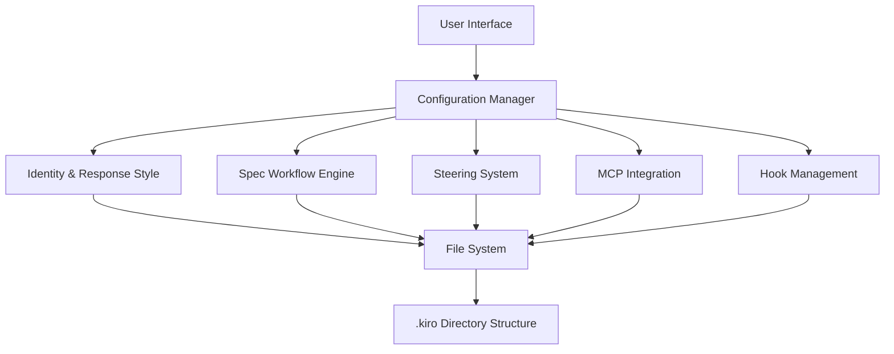

# Kiro Configuration System Design

## Overview

The Kiro Configuration System provides a comprehensive framework for managing Kiro's identity, capabilities, workflow processes, and integrations. The system is designed around configuration files, directory structures, and runtime behavior that enables developers to customize and extend Kiro's functionality while maintaining consistency and security.

## Architecture

The system follows a layered architecture:



## Components and Interfaces

### Configuration Manager
- Central coordinator for all configuration aspects
- Handles file system operations for .kiro directory structure
- Manages configuration validation and merging
- Provides unified interface for all subsystems

### Identity & Response Style Engine
- Processes user input style detection
- Manages tone and communication patterns
- Handles platform-specific adaptations (Windows cmd/PowerShell)
- Enforces security and PII handling rules

### Spec Workflow Engine
- Manages three-phase workflow: Requirements → Design → Tasks
- Enforces EARS format for requirements
- Handles user approval gates between phases
- Coordinates task execution with proper isolation

### Steering System
- Manages .kiro/steering/*.md files
- Processes inclusion modes (always, conditional, manual)
- Handles file reference resolution via "#[[file:...]]" syntax
- Provides context injection for user interactions

### MCP Integration Layer
- Manages mcp.json configuration files (workspace and user level)
- Handles server lifecycle (connect, disconnect, reconnect)
- Processes tool auto-approval and security settings
- Coordinates with uvx/uv package management

### Hook Management System
- Manages event-driven automation
- Handles trigger registration and execution
- Supports both message sending and shell command execution
- Integrates with IDE event system

## Data Models

### Configuration Structure
```
.kiro/
├── specs/
│   └── {feature-name}/
│       ├── requirements.md
│       ├── design.md
│       └── tasks.md
├── steering/
│   └── *.md
└── settings/
    └── mcp.json
```

### Spec Document Format
- Requirements: EARS format with user stories and acceptance criteria
- Design: Structured sections (Overview, Architecture, Components, etc.)
- Tasks: Numbered checkbox list with requirement references

### MCP Configuration Schema
```json
{
  "mcpServers": {
    "server-name": {
      "command": "string",
      "args": ["array"],
      "env": {"object"},
      "disabled": "boolean",
      "autoApprove": ["array"]
    }
  }
}
```

### Steering File Format
```markdown
---
inclusion: "always|fileMatch|manual"
fileMatchPattern: "glob-pattern"
---
# Steering Content
Reference: #[[file:relative/path.ext]]
```

## Error Handling

### Configuration Validation
- Validate JSON schema for MCP configurations
- Check file system permissions for .kiro directory operations
- Verify steering file format and inclusion patterns
- Validate spec document structure and EARS compliance

### Runtime Error Recovery
- Graceful degradation when MCP servers are unavailable
- Fallback behavior for missing steering files
- User-friendly error messages for configuration issues
- Automatic retry mechanisms for transient failures

### Security Safeguards
- PII detection and substitution in all outputs
- Malicious code request detection and blocking
- File system access restrictions to workspace boundaries
- Input sanitization for shell command generation

## Testing Strategy

The testing approach combines unit tests for individual components and integration tests for workflow validation:

### Unit Testing
- Configuration file parsing and validation
- Platform-specific command generation
- EARS format compliance checking
- File reference resolution logic
- Security rule enforcement

### Integration Testing
- Complete spec workflow execution (Requirements → Design → Tasks)
- MCP server configuration and connection testing
- Steering file inclusion and context injection
- Hook trigger and execution validation
- Cross-platform compatibility verification

### Property-Based Testing
Property-based tests will verify system invariants across different inputs and configurations, ensuring robust behavior under various conditions.