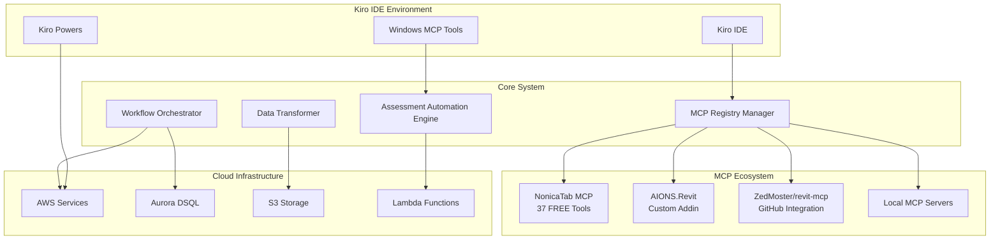

# Design Document

## Overview

The MCP Integration System is a sophisticated orchestration platform that leverages the existing rich MCP ecosystem within Kiro IDE to create automated assessment workflows. The system builds upon NonicaTab MCP (37 FREE Revit tools), AIONS.Revit custom addin, AWS cloud services, Aurora DSQL database, and Windows desktop automation to deliver a comprehensive solution for completing complex assessment tasks spanning multiple applications.

The architecture follows a microservices approach where each component has a specific responsibility, from MCP server discovery and registration to workflow orchestration and data transformation. The system is designed to be extensible, allowing integration of additional MCP servers like ZedMoster/revit-mcp while maintaining compatibility with existing infrastructure.

## Architecture

### High-Level Architecture



### Component Architecture

The system consists of four primary components:

1. **MCP Registry Manager**: Discovers, registers, and manages connections to multiple MCP servers
2. **Workflow Orchestrator**: Coordinates multi-step operations across different applications and services
3. **Data Transformer**: Converts data between application formats (Revit → PowerPoint, etc.)
4. **Assessment Automation Engine**: Specialized engine for completing assessment tasks with AI assistance

## Components and Interfaces

### MCP Registry Manager

**Purpose**: Central registry for discovering and managing MCP server connections within the Kiro ecosystem.

**Key Interfaces**:
```typescript
interface MCPServerDefinition {
  id: string;
  name: string;
  type: 'stdio' | 'http' | 'websocket';
  connectionParams: {
    command?: string;
    args?: string[];
    url?: string;
    port?: number;
    timeout?: number;
  };
  capabilities: string[];
  status: 'available' | 'connected' | 'error' | 'unknown';
  metadata: {
    source: 'local' | 'github' | 'registry';
    version?: string;
    description?: string;
  };
}

interface MCPRegistry {
  discoverServers(): Promise<MCPServerDefinition[]>;
  registerServer(definition: MCPServerDefinition): Promise<void>;
  getServerCapabilities(serverId: string): Promise<string[]>;
  validateServerConnection(serverId: string): Promise<boolean>;
}
```

**Integration Points**:
- Scans for existing NonicaTab MCP at `C:\NONICA\OtherFiles\System\Core\net8.0-windows\RevitMCPConnection.exe`
- Detects AIONS.Revit addin at `C:\AIONS\Revit\AIONS.Revit.dll`
- Fetches GitHub-based servers like ZedMoster/revit-mcp
- Integrates with Kiro Powers for cloud-based MCP servers

### Workflow Orchestrator

**Purpose**: Coordinates complex workflows across multiple MCP servers and cloud services.

**Key Interfaces**:
```typescript
interface WorkflowStep {
  id: string;
  type: 'mcp_call' | 'data_transform' | 'cloud_operation' | 'desktop_automation';
  target: string; // MCP server ID, AWS service, etc.
  operation: string;
  parameters: Record<string, any>;
  dependencies: string[]; // IDs of prerequisite steps
  retryPolicy: {
    maxAttempts: number;
    backoffMs: number;
  };
}

interface WorkflowDefinition {
  id: string;
  name: string;
  description: string;
  steps: WorkflowStep[];
  metadata: {
    assessmentType?: string;
    requiredServers: string[];
    estimatedDuration: number;
  };
}

interface WorkflowOrchestrator {
  executeWorkflow(definition: WorkflowDefinition): Promise<WorkflowResult>;
  getWorkflowStatus(workflowId: string): Promise<WorkflowStatus>;
  pauseWorkflow(workflowId: string): Promise<void>;
  resumeWorkflow(workflowId: string): Promise<void>;
}
```

**Integration Points**:
- Uses Aurora DSQL for workflow state persistence
- Leverages AWS Lambda for cloud-based processing steps
- Integrates with Windows MCP tools for desktop automation
- Coordinates with Kiro Powers for infrastructure operations

### Data Transformer

**Purpose**: Converts data between different application formats while maintaining semantic meaning.

**Key Interfaces**:
```typescript
interface TransformationRule {
  id: string;
  sourceFormat: string; // 'nonicatab_response' | 'revit_element' | 'geometry_data'
  targetFormat: string; // 'powerpoint_table' | 'chart_data' | 'report_section'
  transformFunction: string; // Reference to transformation logic
  validation: {
    required: boolean;
    schema?: object;
  };
}

interface DataTransformer {
  registerTransformation(rule: TransformationRule): void;
  transform(data: any, sourceFormat: string, targetFormat: string): Promise<any>;
  validateTransformation(source: any, target: any, rule: TransformationRule): boolean;
  getAvailableTransformations(sourceFormat: string): string[];
}
```

**Transformation Capabilities**:
- NonicaTab MCP responses → PowerPoint presentation data
- Revit element parameters → Assessment report tables
- Geometric data → Visual diagrams and layouts
- Family/type information → Structured schedules

### Assessment Automation Engine

**Purpose**: Specialized engine for completing assessment tasks using AI assistance and multi-application workflows.

**Key Interfaces**:
```typescript
interface AssessmentTask {
  id: string;
  type: 'data_extraction' | 'analysis' | 'report_generation' | 'presentation_creation';
  requirements: {
    sourceApplications: string[];
    dataTypes: string[];
    outputFormats: string[];
    qualityCriteria: string[];
  };
  workflow: WorkflowDefinition;
}

interface AssessmentAutomationEngine {
  createAssessmentWorkflow(task: AssessmentTask): Promise<WorkflowDefinition>;
  executeAssessment(taskId: string): Promise<AssessmentResult>;
  getAssessmentProgress(taskId: string): Promise<AssessmentProgress>;
  generateReport(assessmentId: string, format: 'pdf' | 'docx' | 'pptx'): Promise<Buffer>;
}
```

**AI Integration**:
- Uses AWS Bedrock for intelligent data analysis
- Leverages Kiro's AI capabilities for workflow optimization
- Integrates with assessment-specific prompts and templates

## Data Models

### Core Data Models

```typescript
// MCP Server Registry
interface MCPServerRegistry {
  servers: Map<string, MCPServerDefinition>;
  capabilities: Map<string, string[]>; // serverId -> capabilities
  connections: Map<string, MCPConnection>;
  lastUpdated: Date;
}

// Workflow Execution State
interface WorkflowExecution {
  id: string;
  definitionId: string;
  status: 'pending' | 'running' | 'paused' | 'completed' | 'failed';
  currentStep: number;
  stepResults: Map<string, any>;
  startTime: Date;
  endTime?: Date;
  error?: string;
  context: Record<string, any>;
}

// Assessment Data Model
interface AssessmentData {
  id: string;
  projectId: string;
  type: string;
  sourceData: {
    revitElements: RevitElement[];
    parameters: ElementParameter[];
    geometry: GeometryData[];
    families: FamilyData[];
  };
  transformedData: {
    presentations: PresentationData[];
    reports: ReportData[];
    charts: ChartData[];
  };
  metadata: {
    extractionTimestamp: Date;
    sourceModel: string;
    assessmentCriteria: string[];
  };
}

// Revit Data Models (from NonicaTab MCP)
interface RevitElement {
  elementId: string;
  category: string;
  familyName: string;
  typeName: string;
  parameters: Record<string, any>;
  geometry: {
    boundingBox: BoundingBox;
    location: Point3D;
  };
  additionalProperties: Record<string, any>;
}

interface ElementParameter {
  elementId: string;
  parameterName: string;
  value: any;
  type: 'string' | 'number' | 'boolean' | 'date';
  isReadOnly: boolean;
  group: string;
}

// Presentation Data Models
interface PresentationData {
  id: string;
  slides: SlideData[];
  template: string;
  metadata: {
    title: string;
    author: string;
    createdDate: Date;
    assessmentType: string;
  };
}

interface SlideData {
  id: string;
  type: 'title' | 'content' | 'chart' | 'table' | 'image';
  title: string;
  content: any; // Varies by slide type
  layout: string;
  notes?: string;
}
```

### Database Schema (Aurora DSQL)

```sql
-- MCP Server Registry
CREATE TABLE mcp_servers (
    id UUID PRIMARY KEY,
    name VARCHAR(255) NOT NULL,
    type VARCHAR(50) NOT NULL,
    connection_params JSONB NOT NULL,
    capabilities TEXT[] NOT NULL,
    status VARCHAR(50) NOT NULL,
    metadata JSONB,
    created_at TIMESTAMP DEFAULT CURRENT_TIMESTAMP,
    updated_at TIMESTAMP DEFAULT CURRENT_TIMESTAMP
);

-- Workflow Definitions
CREATE TABLE workflow_definitions (
    id UUID PRIMARY KEY,
    name VARCHAR(255) NOT NULL,
    description TEXT,
    steps JSONB NOT NULL,
    metadata JSONB,
    created_at TIMESTAMP DEFAULT CURRENT_TIMESTAMP,
    updated_at TIMESTAMP DEFAULT CURRENT_TIMESTAMP
);

-- Workflow Executions
CREATE TABLE workflow_executions (
    id UUID PRIMARY KEY,
    definition_id UUID REFERENCES workflow_definitions(id),
    status VARCHAR(50) NOT NULL,
    current_step INTEGER DEFAULT 0,
    step_results JSONB,
    context JSONB,
    start_time TIMESTAMP DEFAULT CURRENT_TIMESTAMP,
    end_time TIMESTAMP,
    error_message TEXT
);

-- Assessment Data
CREATE TABLE assessments (
    id UUID PRIMARY KEY,
    project_id VARCHAR(255) NOT NULL,
    type VARCHAR(100) NOT NULL,
    source_data JSONB NOT NULL,
    transformed_data JSONB,
    metadata JSONB,
    created_at TIMESTAMP DEFAULT CURRENT_TIMESTAMP,
    updated_at TIMESTAMP DEFAULT CURRENT_TIMESTAMP
);

-- Transformation Rules
CREATE TABLE transformation_rules (
    id UUID PRIMARY KEY,
    source_format VARCHAR(100) NOT NULL,
    target_format VARCHAR(100) NOT NULL,
    transform_function TEXT NOT NULL,
    validation_schema JSONB,
    created_at TIMESTAMP DEFAULT CURRENT_TIMESTAMP
);
```

## Correctness Properties

*A property is a characteristic or behavior that should hold true across all valid executions of a system-essentially, a formal statement about what the system should do. Properties serve as the bridge between human-readable specifications and machine-verifiable correctness guarantees.*

### MCP Server Discovery and Registration Properties

**Property 1: MCP Server Discovery Consistency**
*For any* system scan operation, the MCP Registry Manager should consistently detect existing NonicaTab MCP server at the specified path and return a valid server definition with correct connection parameters
**Validates: Requirements 1.1**

**Property 2: Addin Capability Detection**
*For any* AIONS.Revit installation, the MCP Registry Manager should identify the addin and extract its MCP capabilities, returning a complete capability list
**Validates: Requirements 1.2**

**Property 3: GitHub Integration Validation**
*For any* GitHub MCP server request, the MCP Registry Manager should fetch the server definition, validate its structure, and return a compatible server configuration
**Validates: Requirements 1.3**

**Property 4: Registry State Consistency**
*For any* set of registered MCP servers, the unified registry should maintain consistent state where each server has unique identifiers and non-conflicting capability mappings
**Validates: Requirements 1.4**

**Property 5: Non-disruptive Server Addition**
*For any* new MCP server addition to an active registry, existing server connections should remain stable and functional throughout the addition process
**Validates: Requirements 1.5**

### Workflow Orchestration Properties

**Property 6: Connection Parameter Compliance**
*For any* workflow initiation, the Workflow Orchestrator should establish NonicaTab MCP connections using exactly the stdio protocol with 15000ms timeout as specified
**Validates: Requirements 2.1**

**Property 7: Addin Communication Establishment**
*For any* AIONS.Revit connection attempt, the Workflow Orchestrator should successfully establish communication through the existing addin interface
**Validates: Requirements 2.2**

**Property 8: Connection Monitoring Resilience**
*For any* executing workflow with active MCP connections, the Workflow Orchestrator should detect disconnections and handle them gracefully without workflow failure
**Validates: Requirements 2.3**

**Property 9: Server Unavailability Recovery**
*For any* server that becomes unavailable during workflow execution, the Workflow Orchestrator should implement retry logic and provide fallback options
**Validates: Requirements 2.4**

**Property 10: Multi-server Coordination**
*For any* workflow involving multiple MCP servers, the Workflow Orchestrator should maintain consistent workflow state across all server connections
**Validates: Requirements 2.5**

### Data Extraction and Tool Usage Properties

**Property 11: NonicaTab Tool Utilization**
*For any* Revit data extraction request, the system should utilize the appropriate NonicaTab MCP tools (get_active_view_in_revit, get_user_selection_in_revit, get_elements_by_category) based on the extraction requirements
**Validates: Requirements 3.1**

**Property 12: Model Data Processing Tool Selection**
*For any* model data processing operation, the system should use the correct NonicaTab tools (get_parameters_from_elementid, get_all_additional_properties_from_elementid) to gather comprehensive element information
**Validates: Requirements 3.2**

**Property 13: Geometry Analysis Tool Usage**
*For any* geometry analysis request, the system should leverage the appropriate geometric tools (get_boundingboxes_for_element_ids, get_location_for_element_ids) for spatial analysis
**Validates: Requirements 3.3**

**Property 14: Family and Type Analysis Tool Selection**
*For any* family and type analysis operation, the system should use the correct tools (get_all_used_families_in_model, get_all_used_types_of_families) for comprehensive model analysis
**Validates: Requirements 3.4**

**Property 15: Data Transformation Capability**
*For any* NonicaTab MCP response, the system should successfully convert the data into formats suitable for PowerPoint and other target applications while preserving semantic meaning
**Validates: Requirements 3.5**

### Assessment Automation Properties

**Property 16: Assessment Workflow Validation**
*For any* assessment workflow definition, the Assessment Automation Engine should validate that NonicaTab MCP server is available and AIONS.Revit is accessible before proceeding
**Validates: Requirements 4.1**

**Property 17: Requirement-based Tool Selection**
*For any* assessment requirements (views, elements, parameters), the Assessment Automation Engine should select and use the appropriate NonicaTab tools that match the specific requirements
**Validates: Requirements 4.2**

**Property 18: PowerPoint Content Generation**
*For any* Revit data input, the Assessment Automation Engine should transform the data into presentation-ready formats including charts, tables, and visual summaries suitable for PowerPoint
**Validates: Requirements 4.3**

**Property 19: Error Reporting and Alternative Suggestions**
*For any* workflow step failure, the Assessment Automation Engine should provide detailed error information and suggest alternative approaches using available MCP tools
**Validates: Requirements 4.4**

**Property 20: Progress Tracking Completeness**
*For any* executing assessment workflow, the Assessment Automation Engine should track and report progress for each major step (data extraction, transformation, presentation generation)
**Validates: Requirements 4.5**

### External Server Integration Properties

**Property 21: Conflict-free Integration**
*For any* ZedMoster/revit-mcp integration, the MCP Registry Manager should configure it to work alongside existing NonicaTab MCP without capability conflicts or connection interference
**Validates: Requirements 5.1**

**Property 22: Compatibility Validation**
*For any* GitHub-based MCP server installation, the MCP Registry Manager should validate compatibility with existing Revit installations and AIONS.Revit addin before integration
**Validates: Requirements 5.2**

**Property 23: Capability Mapping and Conflict Avoidance**
*For any* set of active Revit MCP servers, the MCP Registry Manager should provide capability mapping that avoids tool conflicts and optimizes tool selection
**Validates: Requirements 5.3**

**Property 24: Multi-protocol Communication Support**
*For any* combination of MCP servers using different protocols, the MCP Registry Manager should handle both stdio (NonicaTab) and HTTP (ZedMoster) communication protocols correctly
**Validates: Requirements 5.4**

**Property 25: Preference and Fallback Handling**
*For any* overlapping server capabilities, the MCP Registry Manager should provide preference settings and fallback mechanisms for optimal tool selection
**Validates: Requirements 5.5**

### Monitoring and Logging Properties

**Property 26: Comprehensive Operation Logging**
*For any* NonicaTab MCP operation, the system should log all tool invocations with timestamps, parameters, and response data for complete audit trails
**Validates: Requirements 6.1**

**Property 27: Addin Interaction Capture**
*For any* AIONS.Revit interaction, the system should capture communication events and integration points with the workflow system for monitoring purposes
**Validates: Requirements 6.2**

**Property 28: Workflow Progress Tracking with Metrics**
*For any* assessment workflow execution, the system should track progress through each phase with detailed timing metrics for performance analysis
**Validates: Requirements 6.3**

**Property 29: Cross-ecosystem Error Correlation**
*For any* error occurring in any MCP server, the system should correlate errors across the ecosystem and provide comprehensive diagnostic information
**Validates: Requirements 6.4**

**Property 30: Performance Metrics Collection**
*For any* system operation, the system should collect metrics on NonicaTab tool response times, data transformation efficiency, and overall workflow completion rates
**Validates: Requirements 6.5**

### Data Transformation Properties

**Property 31: NonicaTab Response Parsing Completeness**
*For any* NonicaTab MCP response from the 37 FREE tools, the Data Transformer should handle JSON parsing and convert element data, parameters, and geometry into standardized internal formats
**Validates: Requirements 7.1**

**Property 32: PowerPoint Format Generation**
*For any* Revit element data, the Data Transformer should convert it into presentation formats including tables, charts, and visual summaries suitable for PowerPoint integration
**Validates: Requirements 7.2**

**Property 33: Geometric Data Transformation**
*For any* geometric data (bounding boxes, locations, spatial relationships), the Data Transformer should convert it into formats suitable for diagrams and layouts
**Validates: Requirements 7.3**

**Property 34: Family and Type Data Structuring**
*For any* Revit family and type data, the Data Transformer should create structured data suitable for schedules, reports, and presentation materials
**Validates: Requirements 7.4**

**Property 35: Round-trip Validation Integrity**
*For any* data transformation between NonicaTab responses and output formats, the Data Transformer should implement round-trip validation to ensure data consistency
**Validates: Requirements 7.5**

### Security and Compliance Properties

**Property 36: Security Constraint Compliance**
*For any* NonicaTab MCP connection, the system should respect existing security constraints including the requirement for AI Connector to be enabled in Revit
**Validates: Requirements 8.1**

**Property 37: Addin Security Model Compatibility**
*For any* AIONS.Revit integration, the system should maintain compatibility with existing addin security and user permission models
**Validates: Requirements 8.2**

**Property 38: Data Protection Policy Compliance**
*For any* assessment data processing, the system should ensure sensitive project information is handled according to configured data protection policies
**Validates: Requirements 8.3**

**Property 39: Secure Audit Trail Implementation**
*For any* operation logging, the system should implement secure audit trails that protect sensitive project data while maintaining operational visibility
**Validates: Requirements 8.4**

**Property 40: External Server Security Isolation**
*For any* external MCP server integration, the system should validate security credentials and enforce isolation between different MCP server contexts
**Validates: Requirements 8.5**

## Error Handling

### Error Classification

The system implements a comprehensive error handling strategy that categorizes errors into four main types:

1. **Connection Errors**: MCP server unavailability, network timeouts, protocol mismatches
2. **Data Errors**: Invalid responses, transformation failures, validation errors
3. **Workflow Errors**: Step failures, dependency violations, resource constraints
4. **Security Errors**: Authentication failures, permission violations, policy breaches

### Error Handling Strategies

**Retry Mechanisms**:
- Exponential backoff for transient connection errors
- Circuit breaker pattern for persistent server failures
- Configurable retry limits per operation type

**Fallback Options**:
- Alternative MCP servers for overlapping capabilities
- Degraded functionality modes when primary servers are unavailable
- Manual intervention points for critical workflow steps

**Error Recovery**:
- Workflow checkpoint and resume capabilities
- Partial result preservation during failures
- Automatic cleanup of incomplete operations

### Error Reporting

**Structured Error Information**:
```typescript
interface SystemError {
  id: string;
  type: 'connection' | 'data' | 'workflow' | 'security';
  severity: 'low' | 'medium' | 'high' | 'critical';
  source: {
    component: string;
    operation: string;
    mcpServer?: string;
  };
  message: string;
  details: Record<string, any>;
  timestamp: Date;
  correlationId?: string;
  suggestedActions: string[];
}
```

**Error Correlation**:
- Cross-component error tracking using correlation IDs
- Error pattern analysis for proactive issue detection
- Integration with Aurora DSQL for error analytics

## Testing Strategy

### Dual Testing Approach

The system employs both unit testing and property-based testing to ensure comprehensive coverage and correctness validation.

**Unit Testing Focus**:
- Component integration points and interfaces
- Error handling scenarios and edge cases
- Configuration validation and security checks
- Specific workflow step implementations

**Property-Based Testing Focus**:
- Universal properties that must hold across all inputs
- Data transformation correctness across different input types
- Workflow orchestration behavior under various conditions
- MCP server interaction patterns and protocols

### Testing Framework Selection

**Property-Based Testing**: Hypothesis (Python) for property-based tests
- Minimum 100 iterations per property test
- Custom generators for MCP responses, workflow definitions, and assessment data
- Shrinking capabilities for minimal failing examples

**Unit Testing**: pytest (Python) for unit tests
- Mock MCP server responses for isolated testing
- Integration test fixtures for Aurora DSQL
- Test containers for AWS service integration

### Test Implementation Requirements

Each property-based test must:
- Include a comment referencing the specific correctness property from this design document
- Use the format: `# Feature: mcp-integration-system, Property X: [property description]`
- Run a minimum of 100 iterations to ensure statistical confidence
- Include appropriate data generators that respect real-world constraints

### Test Categories

**Integration Tests**:
- End-to-end assessment workflow execution
- Multi-MCP server coordination scenarios
- AWS service integration validation
- Aurora DSQL data persistence verification

**Performance Tests**:
- NonicaTab MCP tool response time validation
- Data transformation efficiency measurement
- Workflow completion rate analysis
- Concurrent operation handling

**Security Tests**:
- Authentication and authorization validation
- Data protection policy compliance
- Audit trail integrity verification
- Cross-server isolation enforcement

### Continuous Testing Strategy

**Automated Test Execution**:
- Pre-commit hooks for unit and property tests
- CI/CD pipeline integration with AWS CodeBuild
- Scheduled integration tests against live MCP servers
- Performance regression detection

**Test Data Management**:
- Synthetic Revit data generation for testing
- Anonymized real-world assessment scenarios
- Version-controlled test fixtures and expectations
- Aurora DSQL test database isolation

This comprehensive testing strategy ensures that the MCP Integration System maintains high reliability and correctness while supporting the complex multi-application workflows required for assessment automation.